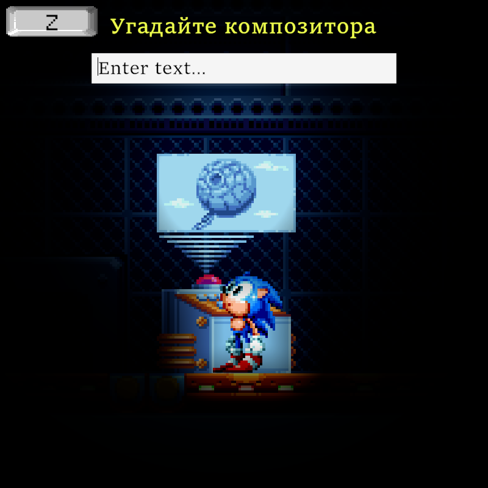

### [English Version](./README.md)

# Sonic's Eduquest

**Sonic's Eduquest**, также известный как **SonicEduquest** — короткий сайдскроллер-паззл, разработанный в Unity 2022.2.0f1.

## 🛠 Состояние Разработки

Данный проект был заархивирован после завершения и ныне доступен как часть портфолио. В данном репозитории две ветки:

* [``develop``](https://github.com/blazingzephyr/sonic-eduquest/blob/develop/README_RU.md) ветка представляет собой завершённую версию игры.
* [``pre-2022.12.01``](https://github.com/blazingzephyr/sonic-eduquest/blob/pre-2022.12.01/README_RU.md) ветка содержит незаконченную устаревшую версию игры. 

## 📝 Цели

Этот проект был разработан как часть школьной дипломной работы.

## 📃 Возможности

Список возможностей, добавленых в игру:

* Простое движение.
* Система взаимодействия.
* Три полностью доделанных комнаты.

## 🛡 Скачать

Вы можете скачать последний релиз [здесь](https://github.com/blazingzephyr/sonic-eduquest/releases/tag/1.0).

## 📂 Установка

Если Вы скачали релиз, то для установки будет достаточно распаковать архив.

## ⚙ Сборка Исходников

Также, Вы могли бы собрать исходники самостоятельно при помощи Unity.

## 💡 Автор

* ZaBlazzingZephyrus ([@blazingzephyr](https://github.com/blazingzephyr))

## 📜 Лицензия

Игра и её исходный код распространяются под [MIT лицензией](https://opensource.org/license/mit/). Посмотрите [LICENSE](https://github.com/blazingzephyr/sonic-eduquest/blob/develop/LICENSE).

Вкратце, Вам разрешено распространять и модифицировать эту игру для личных и коммерческих целей.
Однако, никакие гарантии Вам не предоставляются.

## 📸 Скриншоты

|  |  |
|:-------------------------------------------:|:-----------------------------------------:|
| Комната 1                                   | То же                                     |
|    |    |
| Комната 2                                   | Комната 3                                 |
